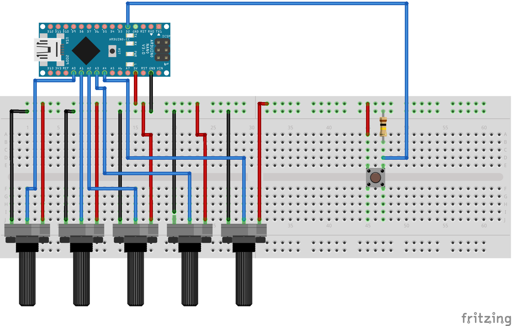

# C++ binary protocol for Flightgear

This is a sample of a binary protocol for Flightgear written in C++ with the purpose of controlling via Arduino (or CLI) the Cessna C172P Model. 

## How to try it out
**DISCLAMER**: I'm working on Ubuntu 18.04, and this repo is developed with Linux-only in mind.

Tested with Flightgear version: 2018.3.1.
Using Arduino NANO.

1. Clone this repository:
```bash
$ git clone https://github.com/danieleperot/fgfs-binary-protocol.git
```
2. CD into the repository and build the executables:
```bash
# Build the client executable (control FlightGear through CLI)
$ make client
# Build the serial executable (control FlightGear through Arduino)
$ make seria
```
3. Copy the generic protocol file `binary-protocol.xml` into the Protocol folder of Flightgear:
```bash
# Flightgear main folder ($FG_ROOT) is usually /usr/share/games/flightgear
# You might need to be root to execute this command!
$ cp ./binary-protocol.xml /usr/share/games/flightgear/Protocol/
# There is also a make option with the default $FG_ROOT folder
$ make copy-protocl
```
4. Run Flightgear:
    * Are you using the GUI? Click on `Settings` and add the following line under `Additional Settings`:
    ```
    --generic=socket,in,1,,10540,udp,binary-protocol
    ```
    * Are you using the CLI version? Execute this command:
    ```bash
    $ fgfs --generic=socket,in,1,,10540,udp,binary-protocol
    ```
5. Run the executable
```bash
# In the repository folder
$ ./client
# or
$ ./serial
```

## Arduino schematic
If you want to use Arduino, build a prototype following this schematic:



You can find the sketch in `arduino-protocol`.

## Change UDP Port
The protocol is a binary protocol working on a UDP Socket on the port 10540.

You can change the port by going inside `serial.cpp` or `client.cpp` and changing the following line:
```c++
// From
FlightGear* flightgear = new FlightGear(10540);
// To 
FlightGear* flightgear = new FlightGear(/* Your port number */);
```
Then change the port number in the `--generic` string as well.
```bash
# From
--generic=socket,in,1,,10540,udp,binary-protocol
# To
--generic=socket,in,1,,[Your Port Number],udp,binary-protocol
```

## Change USB Port
Inside `serial.cpp`, simply add the string of the USB port to the ArduinoConnect constructor:
```c++
ArduinoConnect *arduino = new ArduinoConnect("/dev/ttyUSB0");
```

## Conclusion
Be aware that I'm not a real C++ developer, so don't get too scared on what you will see!

Feel free to fork and modify this repository as you need.

I'm actually happy to learn from other people, so don't esistate to share with me your ideas =)
